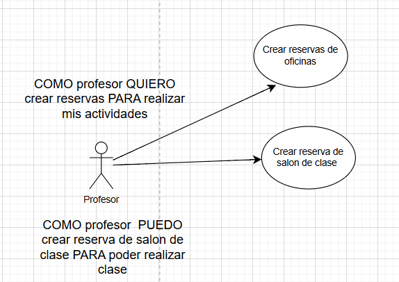

# DOSW_ParcialT1_BrayanLoaiza
### Punto1
## Diagrama de contexto

### Punto2 Patrones
## Factory Method
 # Creacional
 - En las misiones del sistema aparece que se pueden crear tipo
 de reservas considerando las reglas de cada tipo de recurso. Nosostros sabemos que este 
 patro me permite crear objetos teniendo en cuenta que todos son resursos, sin embargo 
 se comportan (reglas) de manera diferente.

 ## Builder 
# Creacional
 - Este patron se puede utilizar ya este nos permite crear objetos de manera
 flexible en el caso de crear la reserva el usuario tiene que ingresar muchos parametros, 
 builder nos puede servir mucho de ayuda para no tener constructores muy grandes.
